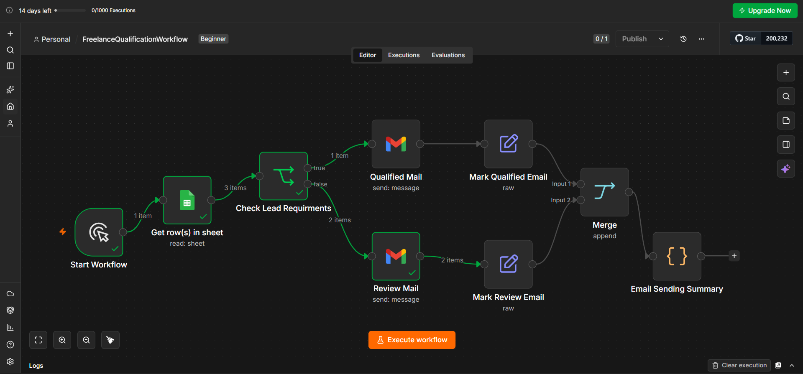

# n8n Freelance Lead Qualification Workflow

This is my first n8n workflow automation project. It reads freelance client requests from Google Sheets, checks their budget and deadline, sends an appropriate email, and displays a summary of the emails sent.

## Workflow Diagram



## How It Works

1. The workflow starts with a Manual Trigger.
2. Client details are read from Google Sheets.
3. The IF node checks the client's budget and deadline.
4. Qualified clients receive a confirmation email.
5. Other clients receive a review email.
6. Both branches are merged.
7. The final node displays the number of emails sent.

## Qualification Conditions

A client request is qualified when:

- Budget is at least $150.
- Deadline is at least 3 days.
- Both conditions must be true.

```text
Budget >= 150 AND Deadline >= 3 days